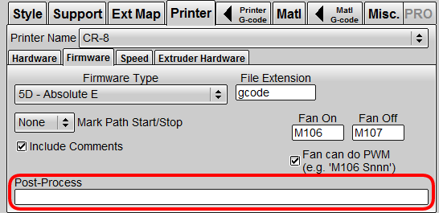

[[中文版](./Readme_zh-TW.md)]

# Introduction
The scripts are developed only for gcode generated by [KISSlicer](http://www.kisslicer.com/). To use the scripts in this folder, you should have [Python 3.x ](https://www.python.org/downloads/) installed.
You can run the script in KISSlicer,
> 1. Download the scripts to KISSlicer folder.
> 2. In KISSlicer, switch to `Printer` tab. Then select `Firmware` sub-tab.
> 3. add script command line in `Posr-Process`. ex: `dgm-temp-tower.py -p "<FILE>"`

Or run the script in Command Prompt
> `C:\KISSlicer> dgm-temp-tower.py yourfile.gcode`

# Usage of scripts

## Heatbed Off

## Pause

## Temperature Tower

> Written with [StackEdit](https://stackedit.io/).